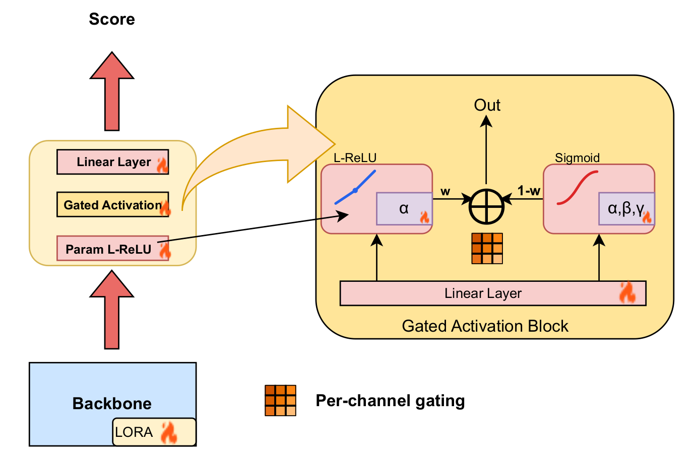

# Revisiting Vision-Language Foundations for No-Reference Image Quality Assessment

### Official repository for the WACV 2026 paper

**[Paper (PDF)](https://openaccess.thecvf.com/content/WACV2026/papers/Yadav_Revisiting_Vision-Language_Foundations_for_No-Reference_Image_Quality_Assessment_WACV_2026_paper.pdf)** | **[arXiv](https://arxiv.org/abs/2509.17374)** | **[WACV 2026 Open Access](https://openaccess.thecvf.com/content/WACV2026/html/Yadav_Revisiting_Vision-Language_Foundations_for_No-Reference_Image_Quality_Assessment_WACV_2026_paper.html)**

> **Ankit Yadav, Ta Duc Huy, Lingqiao Liu**
> The University of Adelaide

We present the first systematic evaluation of six prominent pretrained backbones (CLIP, SigLIP2, DINOv2, DINOv3, Perception, and ResNet) for No-Reference Image Quality Assessment (NR-IQA). Our study uncovers that (1) SigLIP2 consistently achieves strong performance, and (2) the choice of activation function plays a surprisingly crucial role. We introduce a **learnable activation selection mechanism** that adaptively determines the nonlinearity for each channel, achieving new state-of-the-art SRCC on **CLIVE**, **KADID10K**, and **AGIQA3K**.

## Quick Start

```bash
git clone https://github.com/drkkgy/NR_IQA_AGM.git && cd NR_IQA_AGM
pip install -r requirements.txt
python eval.py --dataset CLIVE              # evaluate pretrained checkpoint
```

## Architecture



**Loss**: MSE + pair-wise margin ranking loss

<!-- ## Project Structure

```
NR_IQA_AGM/
├── configs/
│   ├── __init__.py
│   └── default.py            # Default model / training / dataset configs
├── models/
│   ├── __init__.py
│   ├── activations.py        # ParamSigmoid2, ParamLeakyReLU2, GatedBlend
│   ├── mlp_heads.py          # MLP3_Gated, mlp_3_layer
│   └── wrappers.py           # SIGLIPWithMLP (GradCAM-compatible wrapper)
├── Dataset/                  # <-- Place your datasets here (see below)
├── pretrained_checkpoints/   # Pretrained weights (CLIVE, CLIVE->KonIQ, KonIQ->CLIVE)
├── checkpoints/              # Training checkpoints (auto-created)
├── best_checkpoints/         # Best model per dataset (auto-created)
├── resume_state/             # Resume state files (auto-created)
├── results/                  # Evaluation JSON results (auto-created)
├── dataset.py                # PyTorch Dataset classes for all IQA benchmarks
├── seed.py                   # Reproducibility (seed = 8)
├── util.py                   # Clean utilities (loss, metrics, Overlay, constants)
├── util_main.py              # Original util.py (archived, contains all experiments)
├── train.py                  # Training entry point
├── eval.py                   # Evaluation entry point
├── requirements.txt          # pip dependencies
├── environment.yml           # Conda environment spec
└── README.md
``` -->

## Dataset Setup

Create a `Dataset/` folder in the project root and organise each benchmark as shown below.
The exact sub-directory names and annotation files **must** match what `dataset.py` expects.

```
Dataset/
├── KonIQ_10K/
│   ├── koniq10k_512x384/
│   │   └── 512x384/                # 10,073 images
│   └── koniq10k_scores_and_distributions/
│       └── koniq10k_scores_and_distributions.csv
│
├── CLIVE/
│   └── ChallengeDB_release/
│       ├── Data/
│       │   ├── AllImages_release.mat
│       │   ├── AllMOS_release.mat
│       │   └── AllStdDev_release.mat
│       └── Images/                  # 1,162 images
│
├── SPAQ/
│   ├── SPAQ_dataset/
│   │   └── Annotations/
│   │       └── MOS_and_Image_attribute_scores.xlsx
│   └── TestImage/                   # 11,125 images
│
├── KADID-10K/
│   └── kadid10k/
│       ├── dmos.csv
│       └── images/                  # 10,125 images
│
├── FLIVE/
│   ├── labels_image.csv
│   └── database/                    # ~40,000 images (sub-folders inside)
│
├── AGIQA-3k/
│   ├── data.csv
│   └── images/                      # 2,982 images
│
└── AGIQA-1k/
    ├── AIGC_MOS_Zscore.xlsx
    └── images/                      # 1,000 images
```

> **Tip**: You can symlink existing dataset directories instead of copying:
> ```bash
> ln -s /path/to/your/KonIQ_10K Dataset/KonIQ_10K
> ```

## Installation

### Option A: pip (inside an existing environment)

```bash
pip install -r requirements.txt
```

> **Note**: Install PyTorch with the CUDA version matching your GPU driver
> first. See [pytorch.org/get-started](https://pytorch.org/get-started/locally/).

### Option B: Conda (creates a fresh environment)

```bash
conda env create -f environment.yml
conda activate nr_iqa_agm
```

> Edit `pytorch-cuda=12.1` in `environment.yml` if you need a different
> CUDA version (e.g. `11.8`).

## Training

```bash
# Train on KonIQ-10K with default hyperparameters
python train.py --dataset KonIQ_10K

# Train on CLIVE with LoRA rank 8, 20 epochs, batch size 4
python train.py --dataset CLIVE --peft_method LoRA --lora_r 8 --epochs 20 --batch_size 4

# Cross-dataset: train on KonIQ-10K, evaluate on CLIVE
python train.py --dataset KonIQ_10K_CLIVE

# Full fine-tuning (no PEFT adapter)
python train.py --dataset SPAQ --peft_method NA

# Deep Prompt Tuning instead of LoRA
python train.py --dataset KADID10K --peft_method DPT

# Resume a previous run
python train.py --dataset KonIQ_10K --resume

# Dry-run for quick debugging (100 train batches, 32 eval batches)
python train.py --dataset CLIVE --dry_run

# Disable WandB logging
python train.py --dataset CLIVE --no_wandb
```

### Key Training Arguments

| Flag | Default | Description |
|------|---------|-------------|
| `--dataset` | *required* | Dataset to train on (see list above) |
| `--data_dir` | `./Dataset` | Root directory of all datasets |
| `--model_id` | `google/siglip2-so400m-patch16-512` | HuggingFace backbone |
| `--peft_method` | `LoRA` | `LoRA`, `DPT`, or `NA` |
| `--epochs` | `15` | Number of training epochs |
| `--batch_size` | `2` | Per-device batch size |
| `--lr` | `1e-4` | Learning rate |
| `--grad_accum` | `6` | Gradient accumulation steps (effective batch = batch_size * grad_accum) |
| `--lr_milestones` | `30,35` | Comma-separated epoch milestones for MultiStepLR |
| `--checkpoint_steps` | `5000` | Save a checkpoint every N steps |
| `--stage_name` | `AGM_seed8` | Prefix for checkpoint directories |
| `--resume` | off | Resume from the latest `resume_state/` file |
| `--dry_run` | off | Fast debugging mode |
| `--no_wandb` | off | Disable Weights & Biases logging |
| `--no_eval` | off | Skip evaluation during training |
| `--eval_every` | `1` | Evaluate every N epochs |

## Pretrained Checkpoints

The repo ships with pretrained weights in `pretrained_checkpoints/`.
These use the **MLP3_Gated** head (activation gating) with LoRA on SigLIP-2:

| Train set | Test set | Checkpoint directory |
|-----------|----------|---------------------|
| CLIVE | CLIVE | `pretrained_checkpoints/Baseline_param_activation_gating_MSE_seed8_step_train_CLIVE_TestCLIVE_14010` |

> More pretrained checkpoints (cross-dataset) will be added in subsequent updates.

`eval.py` automatically picks the pretrained checkpoint when available — no `--checkpoint_dir` needed.

## Results

Performance comparison with state-of-the-art methods on seven benchmark datasets. Values represent SRCC and PLCC averaged over three runs (seeds: 8, 19, 25). **B**: Baseline, **B_Sig**: Baseline_Sigmoid, **B_Gated**: Baseline_Gated (Ours).

### (a) Non-diffusion methods

| Method | CLIVE | | KonIQ10K | | FLIVE | | SPAQ | | AGIQA3K | | AGIQA1K | | KADID10K | | Average | |
|--------|:-----:|:-----:|:-----:|:-----:|:-----:|:-----:|:-----:|:-----:|:-----:|:-----:|:-----:|:-----:|:-----:|:-----:|:-----:|:-----:|
| | SRCC | PLCC | SRCC | PLCC | SRCC | PLCC | SRCC | PLCC | SRCC | PLCC | SRCC | PLCC | SRCC | PLCC | SRCC | PLCC |
| ILNIQE | .508 | .508 | .523 | .537 | - | - | .713 | .712 | - | - | - | - | .534 | .558 | .570 | .579 |
| BRISQUE | .629 | .629 | .681 | .685 | .303 | .341 | .809 | .817 | - | - | - | - | .528 | .567 | .590 | .608 |
| WaDIQaM | .682 | .671 | .804 | .807 | .455 | .467 | - | - | - | - | - | - | .739 | .752 | .670 | .674 |
| DBCNN | .851 | .869 | .875 | .884 | .545 | .551 | .911 | .915 | - | - | - | - | .851 | .856 | .807 | .815 |
| TIQA | .845 | .861 | .892 | .903 | .541 | .581 | - | - | - | - | - | - | .850 | .855 | .782 | .800 |
| MetaIQA | .835 | .802 | .887 | .856 | .540 | .507 | - | - | - | - | - | - | .762 | .775 | .756 | .735 |
| P2P-BM | .844 | .842 | .872 | .885 | .526 | .598 | - | - | - | - | - | - | .840 | .849 | .770 | .793 |
| HyperIQA | .859 | .882 | .906 | .917 | .544 | .602 | .911 | .915 | - | - | - | - | .852 | .845 | .814 | .832 |
| TReS | .846 | .877 | .915 | .928 | .554 | .625 | - | - | - | - | - | - | .859 | .859 | .794 | .822 |
| MUSIQ | .702 | .746 | .916 | .928 | .566 | .661 | .918 | .921 | - | - | - | - | .875 | .872 | .795 | .826 |
| CONTRIQUE | - | - | - | - | - | - | - | - | .804 | .868 | .670 | .708 | - | - | .737 | .788 |
| RE-IQA | .840 | .854 | .914 | .923 | **.645** | **.733** | .918 | .925 | .785 | .845 | .614 | .670 | .872 | .885 | .798 | .834 |
| GenZIQA | - | - | - | - | - | - | - | - | .832 | .892 | .840 | .861 | - | - | .836 | .877 |
| LoDA | .876 | .899 | .932 | .944 | .578 | .679 | .925 | .928 | - | - | - | - | .931 | .936 | .848 | .877 |
| QCN | .875 | .893 | .934 | .945 | .644 | .741 | .923 | .928 | - | - | - | - | - | - | - | - |
| B | .875 | .905 | .932 | .943 | .533 | .641 | .927 | .931 | .865 | .917 | .857 | .889 | .961 | .964 | .850 | .884 |
| **B_Sig (Ours)** | **.909** | **.930** | .938 | .947 | .521 | .608 | .921 | .926 | **.878** | **.923** | .872 | **.897** | .939 | .943 | .854 | .882 |
| **B_Gated (Ours)** | .887 | .912 | **.953** | **.962** | .556 | .647 | **.928** | **.932** | .867 | .919 | **.873** | .892 | **.970** | **.973** | **.862** | **.891** |

### (b) Diffusion methods

| Method | CLIVE | | KonIQ10K | | FLIVE | | SPAQ | | AGIQA3K | | AGIQA1K | | KADID10K | | Average | |
|--------|:-----:|:-----:|:-----:|:-----:|:-----:|:-----:|:-----:|:-----:|:-----:|:-----:|:-----:|:-----:|:-----:|:-----:|:-----:|:-----:|
| | SRCC | PLCC | SRCC | PLCC | SRCC | PLCC | SRCC | PLCC | SRCC | PLCC | SRCC | PLCC | SRCC | PLCC | SRCC | PLCC |
| DP-IQA | .893 | .913 | .942 | .951 | .579 | .683 | .923 | .926 | - | - | - | - | - | - | .834 | .868 |
| LGDM | .908 | **.940** | **.967** | **.972** | **.705** | **.812** | **.947** | **.948** | .863 | **.929** | **.891** | **.903** | .958 | .961 | **.891** | **.924** |
| B | .875 | .905 | .932 | .943 | .533 | .641 | .927 | .931 | .865 | .917 | .857 | .889 | .961 | .964 | .850 | .884 |
| **B_Sig (Ours)** | **.909** | .930 | .938 | .947 | .521 | .608 | .921 | .926 | **.878** | .923 | .872 | .897 | .939 | .943 | .854 | .882 |
| **B_Gated (Ours)** | .887 | .912 | .953 | .962 | .556 | .647 | .928 | .932 | .867 | .919 | .873 | .892 | **.970** | **.973** | .862 | .891 |

## Evaluation

```bash
# Evaluate using the pretrained CLIVE->CLIVE checkpoint (auto-detected)
python eval.py --dataset CLIVE

# Cross-dataset: pretrained KonIQ_10K->CLIVE checkpoint
python eval.py --dataset KonIQ_10K_CLIVE

# Evaluate a specific (user-trained) checkpoint
python eval.py --dataset KonIQ_10K \
    --checkpoint_dir best_checkpoints/AGM_seed8_train_KonIQ_10K_test_KonIQ_10K

# Skip GradCAM visualisation
python eval.py --dataset SPAQ --no_gradcam

# Custom output path
python eval.py --dataset AGIQA3K --output my_results.json
```

### Key Evaluation Arguments

| Flag | Default | Description |
|------|---------|-------------|
| `--dataset` | *required* | Dataset to evaluate on |
| `--data_dir` | `./Dataset` | Root directory of all datasets |
| `--checkpoint_dir` | auto | Path to checkpoint dir (auto-detected from `best_checkpoints/`) |
| `--batch_size` | `4` | Evaluation batch size |
| `--no_gradcam` | off | Skip GradCAM heatmap generation |
| `--output` | auto | Path to save results JSON |

## Evaluation Metrics

- **SRCC** (Spearman Rank-order Correlation Coefficient): measures monotonic association between predicted and ground-truth scores.
- **PLCC** (Pearson Linear Correlation Coefficient): measures linear correlation after fitting.

## Supported Datasets

| Dataset | Type | # Images | Score Range |
|---------|------|----------|-------------|
| KonIQ-10K | Authentic distortions | 10,073 | MOS / 100 |
| CLIVE | Authentic distortions | 1,162 | MOS / 100 |
| SPAQ | Smartphone photos | 11,125 | MOS / 100 |
| KADID-10K | Synthetic distortions | 10,125 | (DMOS - 1) / 4 |
| FLIVE | Authentic (in-the-wild) | ~40,000 | MOS / 100 |
| AGIQA-3K | AI-generated | 2,982 | MOS_quality / 5 |
| AGIQA-1K | AI-generated | 1,000 | MOS / 5 |

## Cross-Dataset Experiments

Pass a combined dataset ID to `train.py`:

- `KonIQ_10K_CLIVE` — train on KonIQ-10K, evaluate on CLIVE
- `CLIVE_KonIQ_10K` — train on CLIVE, evaluate on KonIQ-10K

## License

See [LICENSE](LICENSE).

## TODO

- [ ] Add pretrained checkpoints for KonIQ-10K, SPAQ, KADID-10K, FLIVE, AGIQA-3K, AGIQA-1K
- [ ] Add cross-dataset pretrained checkpoints (KonIQ-10K -> CLIVE, CLIVE -> KonIQ-10K, etc.)

## Citation

If you use this codebase in your research, please cite:

```bibtex
@InProceedings{Yadav_2026_WACV,
    author    = {Yadav, Ankit and Huy, Ta Duc and Liu, Lingqiao},
    title     = {Revisiting Vision-Language Foundations for No-Reference Image Quality Assessment},
    booktitle = {Proceedings of the IEEE/CVF Winter Conference on Applications of Computer Vision (WACV)},
    month     = {March},
    year      = {2026},
    pages     = {5416-5425}
}
```
